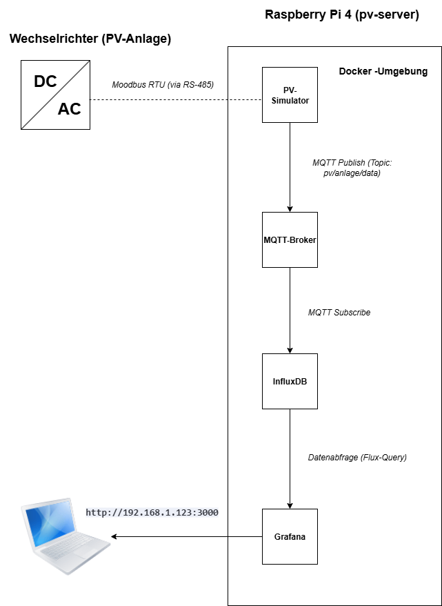

# Pflichtenheft: PV-Anlagen-Überwachungssystem

**Projekt:** PV-Monitoring-System (EcoEnergy Solutions)
**Version:** 1.0
**Datum:** [Aktuelles Datum]

---

## 1. Einleitung

Dieses Dokument beschreibt die technische Umsetzung und Systemarchitektur zur Realisierung der im Lastenheft definierten Anforderungen für ein PV-Anlagen-Überwachungssystem. Das System wird als eine in sich geschlossene, containerisierte Anwendung auf einem Raspberry Pi 4 realisiert.

## 2. Systemarchitektur

Das System wird als "All-in-One Edge Device" konzipiert. Alle für den Betrieb notwendigen Softwarekomponenten werden als Docker-Container auf einem einzelnen Raspberry Pi betrieben. Dieser Ansatz gewährleistet hohe Autonomie, da das System auch ohne Internetverbindung im lokalen Netzwerk voll funktionsfähig bleibt.

Die Kommunikation zwischen den einzelnen Komponenten (Microservices) erfolgt über einen zentralen MQTT-Broker, der als Nachrichtenbus dient. Dies entkoppelt die Datenerfassung von der Datenspeicherung und -visualisierung und sorgt für eine flexible und erweiterbare Architektur.

*(Hinweis: Der Pfad muss ggf. angepasst werden, wenn das Diagramm an anderer Stelle liegt)*

### 2.1 Komponentenbeschreibung

*   **Raspberry Pi 4:** Dient als kostengünstige und energieeffiziente Hardware-Plattform für den gesamten Anwendungsstack.
*   **Docker Engine & Docker Compose:** Verwalten den Lebenszyklus aller Anwendungscontainer und stellen eine isolierte und reproduzierbare Umgebung sicher.
*   **PV-Simulator/Modbus-Reader (Python):** Ein in Python geschriebener Dienst, der (simulierte) Daten vom Wechselrichter abfragt und im JSON-Format an den MQTT-Broker sendet.
*   **Mosquitto:** Ein leichtgewichtiger MQTT-Broker, der als zentrale Kommunikationsschnittstelle für alle Dienste fungiert.
*   **InfluxDB:** Eine für Zeitreihen optimierte Datenbank zur persistenten Speicherung der Messwerte.
*   **Grafana:** Ein web-basiertes Tool zur Visualisierung der in InfluxDB gespeicherten Daten in Form von anpassbaren Dashboards.

## 3. Technische Umsetzung der Anforderungen

Hier wird detailliert beschrieben, wie die funktionalen (FR) und nicht-funktionalen (NFR) Anforderungen aus dem Lastenheft technisch umgesetzt werden.

| Anforderung | Technische Umsetzung |
| :---------- | :------------------ |
| **FR-01-04 (Datenerfassung)** | Ein Python-Skript (`modbus_reader.py`) wird entwickelt. Es nutzt die Bibliothek `pymodbus`, um via RS-485-Adapter mit dem Wechselrichter zu kommunizieren. In der Entwicklungsphase wird ein Simulator (`pv_simulator.py`) verwendet, der realitätsnahe JSON-Daten erzeugt. |
| **FR-05 (Datenübertragung)** | Der Mosquitto MQTT-Broker wird als Docker-Container bereitgestellt. Das Python-Skript agiert als MQTT-Client (Publisher) und sendet die Daten an das Topic `pv/anlage/data`. |
| **FR-06-07 (Datenspeicherung)** | Eine InfluxDB 2.x Instanz läuft als Docker-Container. Ein Telegraf-Container (wird später hinzugefügt) wird das MQTT-Topic abonnieren und die Daten automatisch in den InfluxDB-Bucket `pv_data` schreiben. |
| **FR-08-10 (Visualisierung)** | Eine Grafana-Instanz wird als Docker-Container betrieben und ist im lokalen Netzwerk über Port 3000 erreichbar. In Grafana wird eine Datenquelle (DataSource) für die InfluxDB-Instanz konfiguriert. Ein Dashboard wird erstellt, das die Daten mittels Flux-Queries abfragt und in Graphen darstellt. |
| **FR-11-12 (Alarmierung)** | Die Alarmierungsfunktion von Grafana wird genutzt. Schwellenwerte für Leistungswerte werden im Dashboard konfiguriert. Bei Unter- oder Überschreitung wird Grafana eine E-Mail-Benachrichtigung über einen konfigurierten SMTP-Server senden. |
| **NFR-02 (Zuverlässigkeit)** | Alle Docker-Container werden mit der `restart: unless-stopped`-Policy konfiguriert. Dies stellt sicher, dass alle Dienste nach einem Neustart des Raspberry Pi automatisch wieder hochfahren. |
| **NFR-03 (Wartbarkeit)** | Die gesamte Anwendungsstack-Definition erfolgt in einer einzigen `docker-compose.yml`-Datei. Dies ermöglicht das Starten, Stoppen und Aktualisieren des gesamten Systems mit einfachen Befehlen (`docker-compose up`, `docker-compose down`). |

## 4. Technologiestack

| Technologie | Version | Zweck |
| :--- | :--- | :--- |
| Raspberry Pi OS Lite | 64-bit | Betriebssystem |
| Python | 3.9+ | Skriptsprache für Datenerfassung |
| Docker Engine | 20.10+ | Container-Runtime |
| Docker Compose | 2.0+ | Orchestrierung der Container |
| Eclipse Mosquitto | 2.0+ | MQTT-Broker |
| InfluxDB | 2.7+ | Zeitreihendatenbank |
| Grafana | 10.0+ | Visualisierungsplattform |
